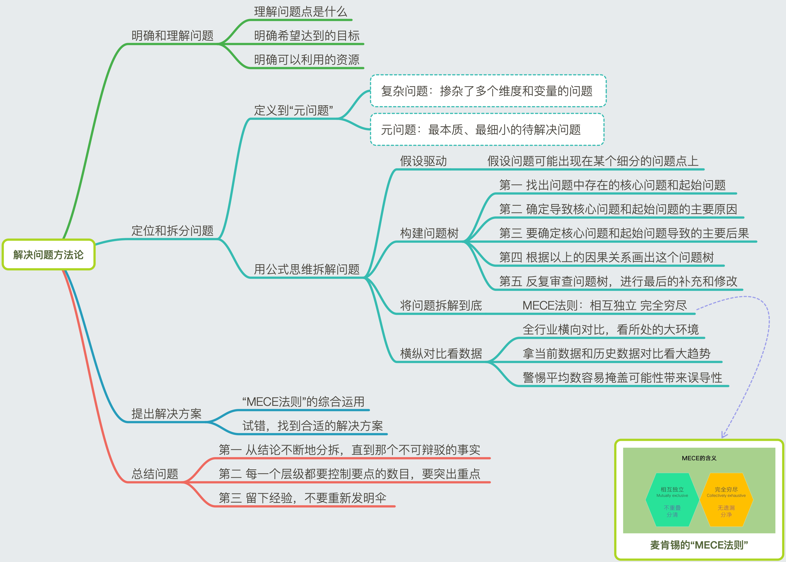

# 解决问题方法论  

>一个真正的高手，其实应该有能力用一套方法论去解决问题的所有，不管这个问题再难，再新鲜，再简单都能搞定。

## 明确和理解问题
  
* 理解问题点是什么
  
* 明确希望达到的目标
  
* 明确可以利用的资源
  
## 定位和拆分问题
  
### 定义到“元问题”
  
* 复杂问题：掺杂了多个维度和变量的问题
* 元问题：最本质、最细小的待解决问题
  
### 用公式思维拆解问题
  
* 假设驱动
	* 假设问题可能出现在某个细分的问题点上
* 构建问题树
	* 第一 找出问题中存在的核心问题和起始问题
	* 第二 确定导致核心问题和起始问题的主要原因  
	* 第三 要确定核心问题和起始问题导致的主要后果  
	* 第四 根据以上的因果关系画出这个问题树
	* 第五 反复审查问题树，进行最后的补充和修改
* 将问题拆解到底
	* MECE法则：相互独立 完全穷尽
* 横纵对比看数据
	* 全行业横向对比，看所处的大环境
	* 拿当前数据和历史数据对比看大趋势
	* 警惕平均数容易掩盖可能性带来误导性
  
## 提出解决方案
  
*  “MECE法则”的综合运用
  
*  试错，找到合适的解决方案
  
## 总结问题
  
* 第一 从结论不断地分拆，直到那个不可辩驳的事实
  
* 第二 每一个层级都要控制要点的数目，要突出重点
  
* 第三 留下经验，不要重新发明伞